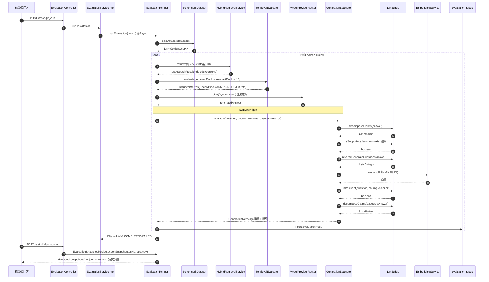
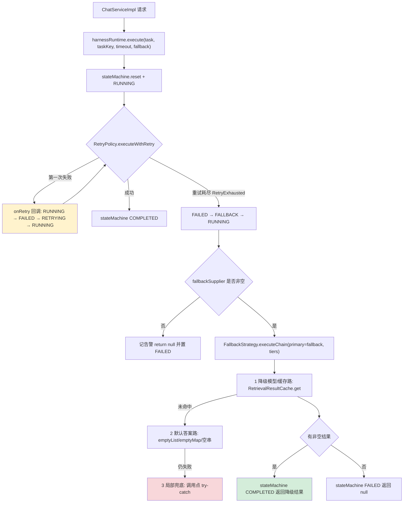

# AGI Assistant 增量架构设计与任务分解

| 项 | 内容 |
|---|---|
| 文档 | `docs/incremental-arch.md` |
| 作者 | 架构师 高见远 |
| 输入 | `docs/incremental-prd.md`（REQ-01 ~ REQ-14） |
| 技术栈 | Spring Boot 3.2.5 / Java 17 / MyBatis-Plus 3.5.5 / Maven；Vue3 + TS + Vite5 + Element Plus |
| 范围 | 仅描述本次增量变更，不改动已落地能力（三路召回+RRF、Markdown 清洗、层级 Chunk、实体抽取、图扩散、四层记忆、DAG、JWT、沙箱安全参数、11 个测试文件 144 单测） |

## 0. 全局约束与降级基线（先读）

三条硬约束贯穿全文，任何设计违反其一即视为不合格：

| 编号 | 约束 | 设计落实 |
|---|---|---|
| C1 | `mvn clean package` 必须通过，产物可直接部署 | 不新增任何编译期强依赖；所有新第三方能力（Kafka 消费、Ark）均走「可选 Bean + 属性门控」，缺失时仅退化为本地路径 |
| C2 | Kafka/Milvus/Neo4j 在 `.env` 中 `ENABLED=false`，新代码必须在缺失时优雅降级、不影响启动 | 新增 Bean 一律用 `@ConditionalOnProperty` 或「构造期不建连、调用期 gate」；**禁止在 `@PostConstruct` 里做网络连接** |
| C3（诚信红线） | 严禁编造任何评测数字 | 所有指标由真实 LLM/检索管线跑出；管线不可用时返回 `null` 或 `-1.0` 并在快照中标注 `"evaluated": false`，**绝不写死数值填充** |

**降级基线表**（部署到无中间件服务器后的行为）：

| 依赖 | 缺失时行为 | Git 位置 |
|---|---|---|
| MySQL | 必需，无降级（启动即依赖） | `application.yml` datasource |
| Redis | 必需（短期记忆/缓存），未在本次改动范围 | — |
| Elasticsearch | 稀疏检索单路返回空 → 检索降级为可用路 | `HybridRetrievalService.executeSparse` 已有 try-catch |
| Milvus (`MILVUS_ENABLED=false`) | 稠密路跳过，`isAvailable()` gate 已存在 | `executeDense` |
| Neo4j (`NEO4J_ENABLED=false`) | 图谱路跳过；图记忆/多跳扩散静默降级 | `executeGraph` + 既有 gate |
| Kafka (`spring.kafka.enabled=false`) | 审计走 DB 主路径 + 本地日志；**消费者 Bean 不装配** | `KafkaConfig`/`AuditService` 已有；新增消费者沿用该门控 |
| Ark (`ark.enabled=false`) | `/api/models/providers` 中列为不可用；调用方回退 GLM | **本次新增** |
| 外部 LLM/Embedding 不可达 | 评测指标返回 `null`/`-1`，**不伪造** | 本次强化 |

---

## 1. 实现方案总览（逐 REQ）

### REQ-01 真实 RAGAS 机制（P0）

**现状问题**：`GenerationEvaluator` 四个方法（`scoreFaithfulness:87-106` 等）结构完全一致，都是「一段 prompt 结尾求 0~1 数字」，走 `callLLMForScore:181-205`（`max_tokens=10`），本质是让 LLM 直接报一个数，不符合 RAGAS 任一机制。

**目标**：四个指标各自实现独立算法，并可被单测在**无网络**下验证。

**方案**（重写 `GenerationEvaluator`，抽出可替换的 `LlmJudge` 与复用 `EmbeddingService`）：

1. **Faithfulness = claim 分解 + 逐条核验**
   - `decomposeClaims(answer)` → `List<Claim>`（LLM 把答案拆成原子事实声明）
   - 对每条 claim 调 `isSupported(claim, contexts)` → `boolean`
   - `faithfulness = 被支持 claim 数 / claim 总数`；claim 总数为 0 时返回 `1.0`（空答案视为无幻觉）
2. **Answer Relevancy = 反向生成问题 + 与原问算相似度（RAGAS 原式）**
   - `reverseGenerateQuestions(answer, n=3)`（LLM）→ 若干「该答案能回答的问题」
   - 对每个生成问题与**原问题**分别取 embedding（复用 `EmbeddingService.embed`），算余弦相似度，取均值
   - embedding 不可用（远程失败且本地降级向量无意义）时，退化为**词元 Jaccard 相似度**（确定性、本地、可单测）
3. **Context Precision = 逐 chunk 相关性判定 + 排序加权（AP@K 均值平均精度）**
   - 对第 i 个 chunk 调 `isRelevant(question, chunk)` → `rel_i ∈ {0,1}`
   - `AP = Σ_{k=1..K} (P@k · rel_k) / Σ rel_k`（无相关 chunk 时返回 `0.0`）
4. **Context Recall = golden answer claim 覆盖率**
   - `decomposeClaims(expectedAnswer)` → claims
   - 对每条 claim 判定是否被**检索上下文整体**支持（`isSupported(claim, contexts)`）
   - `recall = 被覆盖 claim 数 / claims 总数`

**为什么这样改**：把「LLM 直接报数」换成「LLM 做可验证的子判断（拆 claim / 判相关 / 生问题）+ 本地确定性聚合」。聚合数学留在 Java 里 → 可单测、可复现、面试可追问每一步。`LlmJudge` 抽成接口后，单测注入 stub 即可在离线环境跑绿。

**保留兼容**：`evaluate(question, answer, contexts, expectedAnswer)` 方法签名不变（`EvaluationRunner:110-113` 依赖它）；`GenerationMetrics` 4 个主字段不变，仅**追加非数值明细字段**（避免污染 `EvaluationServiceImpl.computeAverageGenerationMetrics:229-257` 的数值平均）。

---

### REQ-02 火山方舟 Ark 可配置 provider（P0）

**现状**：`OpenAIConfig`（`@ConfigurationProperties("openai")`）单 provider，`baseUrl/apiKey/model` 全局唯一。

**方案**：引入 `ModelProvider` 抽象，GLM 与 Ark 各一实现，由 `ModelProviderRouter` 按配置选择、缺 key 时回退。

- `ModelProvider` 接口：`String name()` / `boolean isAvailable()` / `String chat(messages, temperature, maxTokens)`
- `GlmModelProvider`：包装既有 `openAiWebClient`（复用 `OpenAIConfig`）
- `ArkModelProvider`：自持 `ArkProperties`（`ark.*`），**构造期只读配置、不建连**；`isAvailable() = ark.enabled && apiKey非空`；WebClient 懒建（首次 `chat` 时）
- `ModelProviderRouter.chat(...)`：`llm.provider` 指定（默认 `glm`）；若指定的 provider 不可用 → 记录告警并回退 GLM；GLM 也不可用 → 抛 `ProviderUnavailableException`（由调用方决定降级）
- **非空调用方**：① `EvaluationRunner.generateAnswer` 改用 `router.chat(...)`（评测生成答案可切换模型，天然满足「模型选型对比」）；② 新增 `ModelController: GET /api/models/providers` 返回各 provider 可用性（给前端/运维）

**为什么用 Router 而非多 Bean `@Primary`**：需要运行期按配置切换 + 可用性回退，且 Ark 关闭时 `ArkModelProvider` 仍应是合法 Bean（`isAvailable()=false`）而不是消失的 Bean——消失会导致 `@Autowired` 找不到、又要写 `@Autowired(required=false)`，反而更脆。

---

### REQ-03 数据集构建与结果快照导出管线（P0）

**方案**：

- **benchmark 构建**：`BenchmarkDataset` 新增 `int buildFromDocuments(String datasetId, int limit, boolean useLlm)`：
  - 取 `status ∈ {COMPLETED, PARTIAL}` 的文档（沿用既有语义修复）
  - 每篇文档：`relevant_doc_ids = [docId]`（真实 id）；`query` 由 LLM 从「标题 + 首 chunk」生成（`useLlm=false` 或 LLM 不可用时回退为标题）；`expectedAnswer` = 首 chunk 截断
  - 逐条 `goldenQueryMapper.insert` 落库（复用 `addGoldenQuery`）
- **快照导出**：新增 `EvaluationSnapshotService.exportSnapshot(Long taskId, String strategy)`：
  - 从 `evaluation_result` 拉全部结果 → 读取 `retrieval_metrics`/`generation_metrics` JSON
  - 逐 query 记录 + 汇总均值（**运行时现算，不落库**，对齐 `EvaluationServiceImpl` 口径）
  - 写出 `docs/eval-snapshots/{datasetId}-{strategy}-{yyyyMMdd-HHmmss}.json` 及同名 `.md`（人读）
  - **结构确定性**：所有 Map 用 `LinkedHashMap`；字段顺序固定（`meta/retrieval/generation/perQuery`）；不含「随机/时间」以外的易变字段；时间戳只放 `meta.generatedAt`
  - **未评估指标**（值为 `-1.0`）输出为 `null` 且 `evaluated=false`，**不填数字**
- **Controller 新增**：`POST /api/evaluation/datasets/build`、`POST /api/evaluation/tasks/{id}/snapshot`、`GET /api/evaluation/snapshots`（列已导出文件）

**为什么「重复跑结构一致」可保证**：schema 由 `EvaluationSnapshot` DTO 固定；perQuery 按 `queryId` 升序稳定排序；数值不做四舍五入以外的加工。

---

### REQ-04 检索/生成八指标单测（P1）

新增两个测试类，**全部离线可跑**：
- `RetrievalEvaluatorTest`：构造 4 组手算用例覆盖 Recall@K / Precision@K / MRR / NDCG@K（含边界：expected 为空、检索不足 K、全命中、全不中）
- `GenerationEvaluatorTest`：注入 stub `LlmJudge`（返回预设 claim/相关性）+ stub `EmbeddingService`（返回固定向量），断言四指标数值精确等于手算值；再补一条「LLM 抛异常 → 指标为 -1.0」的降级用例

---

### REQ-05 Harness 真实降级链（P0）

**现状**：`FallbackStrategy.executeWithFallback:34`、`degradedResponse:60` 零调用；`HarnessRuntime.execute` 的 fallback 分支只在 `ChatServiceImpl:303`（ReAct）被用，且降级值是 `() -> ""`。

**方案**：

- `FallbackStrategy` 新增 `executeChain(Supplier<T> primary, List<Supplier<T>> tiers, String taskName)`：主策略失败 → 依次尝试各 tier → 全失败返回 `null`（并记告警）。原 `executeWithFallback`/`gracefulDegrade` 保留。
- 新增 `ChatFallbackProvider`（`service/harness`）提供**每类操作的多级降级供应商**：
  - **检索**：① 降级模型/缓存路 = `RetrievalResultCache.get(query)`（进程内 LRU，记录上次成功结果）② 默认答案路 = `Collections.emptyList()`
  - **网络搜索**：① 缓存路 ② 空列表
  - **记忆组装**：① 局部兜底 = 用 `ShortTermMemory` 现拼一个最小 context（不查 LTM/图谱）② 空 Map
  - **ReAct**：`() -> ""`（空串 → 走普通流式回答）
- `ChatServiceImpl` 四个 `HarnessRuntime.execute` 调用点**全部传入非空 fallback**：
  - `:238 rag-retrieval` → `() -> chatFallbackProvider.retrievalFallback(query)`（并尝试写缓存）
  - `:259 web-search` → `() -> chatFallbackProvider.webSearchFallback(query)`
  - `:282 memory-assembly` → `() -> chatFallbackProvider.memoryFallback(userId, sessionId, query)`
  - `:300 react-engine` → 保留 `() -> ""`（已是有效降级）
- `FallbackStrategy` 调用方由 0 → ≥2（`HarnessRuntime` + `ChatFallbackProvider.executeChain`）

**链的语义**：`降级模型`（Router 回退 GLM）→ `缓存`（LRU 命中）→ `默认答案`（空集合）→ `局部兜底`（调用点 try-catch）。四层在 `ChatFallbackProvider` 里串联成 `executeChain`。

---

### REQ-06 工具维度隔离执行（P1）

**现状**：`ReactEngine.doAct → toolRegistry.executeTool` 在调用线程同步执行；`run_code`（Docker 沙箱）会长时间阻塞。

**方案**：新增 `ToolExecutorService`：
- 维护 `Map<ToolCategory, ExecutorService>`（`ToolCategory` 按工具名映射：`SEARCH`/`MEMORY`/`COMPUTE`/`CODE`/`DEFAULT`），每类一个**有界** `ThreadPoolExecutor`（core/max/queue 可配）
- `ToolResult executeIsolated(String toolName, Supplier<ToolResult> action, long timeoutMs)`：提交到该类池 + `future.get(timeout)`，超时 → `future.cancel(true)` 且返回 `ToolStatus.TIMEOUT`
- `ToolRegistry.executeTool` 改为委托 `ToolExecutorService`

**效果**：`run_code` 阻塞只占满 `CODE` 池；`knowledge_search` 走 `SEARCH` 池，仍能正常返回。这正是「单工具阻塞不影响其他工具」的构造性证明。

---

### REQ-07 统一 Tool Result Schema + ToolStatus 赋值（P1）

**现状**：结果靠 Map 键约定（`"status"/"result"/"error"`，见 `ToolRegistry:147-151/204-206`、`ReactEngine.doAct:443-458`）；`ToolStatus.TIMEOUT/PARTIAL` 零赋值。

**方案**：
- 新增 `com.agi.assistant.model.dto.ToolResult`（字段见第 3 节）
- 新增函数式接口 `ToolHandler { ToolResult handle(Map<String,Object> params); }`
- `ToolRegistry.registerTool` 新增 `registerTool(name, desc, risk, ToolHandler)` 重载；旧的 `Function<Map,Map>` 重载保留并适配（内部包成 `ToolResult.fromMap`）——保证既有调用方零改动
- `executeTool` 返回 `ToolResult`；**为兼容**保留 `executeToolAsMap(...)`（`ToolResult.toMap()`）供未迁移的调用方
- **TIMEOUT 赋值路径**：`ToolExecutorService` 超时分支
- **PARTIAL 赋值路径**：`ReactEngine.observe` 截断超长结果时，标记 `PARTIAL` 并回填 `truncated=true`；`ToolResult` 提供 `markPartial(reason)`
- 修正 `ToolRiskClassifier.classifyParamsOnly:133-142`：高置信度危险参数（`rm -rf`/`drop table`/`curl|sh`）由「封顶 WARN」改为返回 **BLOCK** → 使 `ToolRegistry` 的 BLOCK 拦截分支（`:173-182`）**现网可达**

---

### REQ-08 状态机可达性（P1）

**现状**：`TRANSITIONS` 已含 `RUNNING→FAILED→RETRYING→RUNNING`，但 `RetryPolicy.executeWithRetry` 内部重试时**不驱动状态机**，故 `RETRYING` 永不出现；`StateMachine.remove:100` 零调用。

**方案**：
- `RetryPolicy` 新增重载 `executeWithRetry(Supplier<T> action, RetryPolicy policy, IntConsumer onRetry)`：每次「准备重试」前回调 `onRetry.accept(attempt)`
- `HarnessRuntime.execute` 传入回调：`attempt -> { stateMachine.transition(name, FAILED); stateMachine.transition(name, RETRYING); stateMachine.transition(name, RUNNING); }`
  - 合法性校验：进入重试前状态应为 `RUNNING`（首轮已置）→ `RUNNING→FAILED` 合法；`FAILED→RETRYING` 合法；`RETRYING→RUNNING` 合法
- `StateMachine.remove` 调用方：`ChatServiceImpl` 在每个请求的 `finally` 中，对本次用到的唯一 taskName 调 `stateMachine.remove`（配合 REQ-09 的 taskName 唯一化，避免 `taskStates` Map 无界增长）

**验证**：单测让主策略前 N 次失败，断言过程中 `getStatus(name)==RETRYING` 被观测到。

---

### REQ-09 并发隔离与异常兜底（P0，最高风险）

**根因**：`ChatServiceImpl` 四处 `HarnessRuntime` 用**固定常量 taskName**（`"rag-retrieval"`/`"web-search"`/`"memory-assembly"`/`"react-engine"`）。多用户并发时共享同一 StateMachine key，互相 `reset`/`transition` → `StateMachine:52-56` 抛 `IllegalStateException`；其中 `:238` 的 `rag-retrieval` **没有 try 包裹**，异常直接击穿 SSE。

**方案**：
- 新增私有方法 `private String taskKey(String base, String sessionId)` → `base + "#" + sessionId`（sessionId 为本次请求的会话标识，缺失时用 `UUID` 兜底）
- 四处调用改用唯一 taskName；StateMachine key 按会话隔离，≥50 并发互不干扰
- `rag-retrieval` 调用点补 try-catch（与另三处一致）：异常时 `searchResults = new ArrayList<>()` 并发送"检索降级"事件，**绝不中断 SSE**
- `finally` 中 `stateMachine.remove` 每个唯一 taskName 做清理

---

### REQ-10 审计消费闭环（P1）

**现状**：`KafkaConfig` 已有生产者/消费者工厂，但全项目 `@KafkaListener` 为 0；`AuditService` 已「DB 主写 + Kafka 旁路」。

**方案**：
- 新增 `AuditKafkaConsumer`：`@ConditionalOnProperty(name="spring.kafka.enabled", havingValue="true")` + `@KafkaListener(topics=TOPIC_AUDIT_LOG, groupId=...)`，方法 `onMessage(AuditLog log)` → 落 `audit_log`
- **去重（关键）**：`AuditService.persist` 已写 DB，若消费者再写会**重复**。解法：给 `AuditLog` 增加 `eventId`（UUID，`AuditService` 写入前生成），`audit_log` 加唯一索引；消费者走 `AuditLogMapper.insertIgnore(log)`（`INSERT IGNORE`）→ 幂等
- **Kafka 不可用降级**：`spring.kafka.enabled=false` 时消费者 Bean 不装配；`=true` 但 broker 断开时，容器按 `DefaultErrorHandler`+DLT 处理，仅记录告警，**不影响应用启动与核心接口**（`missing-topics-fatal: false` 已配）

**为什么不是「关掉 DB 写、只靠 Kafka」**：审计的本质是可追溯，Kafka 是可选组件；把审计绑在可选组件上 = 默认没有审计（既有注释已论证）。故保持 DB 主写，消费者做幂等旁路。

---

### REQ-11 沙箱确认门槛（P0）

**现状**：`BuiltinToolRegistrar:250` 硬编码 `request.setConfirmed(true)`，绕过 `sandbox.require-confirm`。

**方案**：`run_code` handler 改为从参数读取：
- `boolean confirmed = boolParam(params, "confirmed", false)` → `request.setConfirmed(confirmed)`
- `sandbox.require-confirm=true` 且 `confirmed=false` → `SandboxServiceImpl:56-62` 拦截并审计（既有逻辑）
- 未确认时 `run_code` 返回结构化"被拒绝"（`ToolStatus.FAILURE`，`error="需要确认"`），ReAct 观测到后会询问用户，实现「LLM 不能无确认触发执行」
- 前端/用户可用 `{"confirmed": true}` 参数走确认路径

**为什么不做"自动确认"兜底**：自动确认即等于取消该门槛；红线是"未确认必须被拦截"，保持确定行为。

---

### REQ-12 Planner State 写入接入（P1）

**现状**：`RuntimeStateMemory.updatePlan:49 / advancePlanStep:60 / completePlan:94` 零调用；`getOrCreatePlannerState:39` 被 `ContextAssembly:125` 读 → Planner 恒为 `PLANNING` 空计划 → `assembleRuntimeContext:311` 的 Planner 段恒空。

**方案**：在 `ReactEngine.runLoop` 内埋点（与既有 `createTask/updateTaskProgress` 同一层）：
- 循环开始：`PlanFactory.build(query, useLlm)` 产出 `List<String>` 计划步骤，`runtimeStateMemory.updatePlan(sessionId, steps)`
  - `useLlm` 时用 LLM 分解；不可用/关闭时回退**启发式计划**（如 `["检索相关知识", "推理分析", "生成最终答案"]`）——真实、非占位数字
- 每轮迭代末：`runtimeStateMemory.advancePlanStep(sessionId)`
- 结果收敛（`finish` 或达到上限）：`runtimeStateMemory.completePlan(sessionId)`
- 全部 try-catch 包裹（埋点失败不得影响推理，沿用既有风格）

**验收**：执行后 `getOrCreatePlannerState(sessionId).getPlan()` 非空，`ContextAssembly` 的 `runtimeState` 段含"## 当前计划状态"。

---

### REQ-13 前端 FULL 策略（P1）

**现状**：`ChatView.vue:76-81` 选择器缺 `full`；`types/index.ts:60` 已含 `'full'`；后端 `HybridRetrievalService` 的 `FULL` 分支与加权 RRF 已就绪（`executeFull:221-251`）。

**方案**：`ChatView.vue` 选择器新增 `<el-option label="全量检索(FULL)" value="full" />`。后端无需改动：`ChatServiceImpl` 将 `"full"` 透传给 `hybridRetrievalService.retrieve(msg, "full", 5)`，内部 `valueOf("FULL")` 命中 `executeFull` → 触发三路加权 RRF。**这是全项目最小改动项**。

---

### REQ-14 可构建与独立启动（P0）

**方案**：
- 新增 `StartupCapabilityLogger`（`ApplicationRunner`）：启动时打印各可选依赖（Milvus/Neo4j/Kafka/Ark/LLM/Embedding）的启用与可用状态，作为部署自检
- 所有新增 Bean 均满足 C2；`mvn clean package` 后产物 `target/agi-assistant-1.0.0-SNAPSHOT.jar` 可在无 Kafka/无 Neo4j 环境启动
- 新增 `scripts/smoke.sh`：`java -jar` + 探活 `/actuator` 或核心接口（或 /api/models/providers）验证启动成功
- 更新 `.env.example` 与 `application.yml` 补齐新键

---

## 2. 文件清单

> 路径相对仓库根 `D:\code\AGI Assistant`。`[新]`=新增，`[改]`=修改。

### 后端：评测模块
| 文件 | 动作 | 说明 |
|---|---|---|
| `src/main/java/com/agi/assistant/service/evaluation/GenerationEvaluator.java` | [改] | RAGAS 四指标重写 |
| `src/main/java/com/agi/assistant/service/evaluation/llm/LlmJudge.java` | [新] | LLM 判定抽象接口 |
| `src/main/java/com/agi/assistant/service/evaluation/llm/WebClientLlmJudge.java` | [新] | 基于 WebClient 的实现（GLM） |
| `src/main/java/com/agi/assistant/service/evaluation/Claim.java` | [新] | claim 数据模型 |
| `src/main/java/com/agi/assistant/service/evaluation/RagasScorer.java` | [新] | 四指标纯函数聚合（可单测） |
| `src/main/java/com/agi/assistant/service/evaluation/BenchmarkDataset.java` | [改] | 新增 `buildFromDocuments` |
| `src/main/java/com/agi/assistant/service/evaluation/EvaluationSnapshotService.java` | [新] | 快照导出 |
| `src/main/java/com/agi/assistant/model/dto/EvaluationSnapshot.java` | [新] | 快照 DTO |
| `src/main/java/com/agi/assistant/service/evaluation/EvaluationRunner.java` | [改] | generateAnswer 走 ModelProviderRouter |
| `src/main/java/com/agi/assistant/controller/EvaluationController.java` | [改] | 新增 build/snapshot 端点 |

### 后端：模型 Provider
| 文件 | 动作 |
|---|---|
| `src/main/java/com/agi/assistant/service/llm/ModelProvider.java` | [新] |
| `src/main/java/com/agi/assistant/service/llm/GlmModelProvider.java` | [新] |
| `src/main/java/com/agi/assistant/service/llm/ArkModelProvider.java` | [新] |
| `src/main/java/com/agi/assistant/service/llm/ModelProviderRouter.java` | [新] |
| `src/main/java/com/agi/assistant/config/ArkProperties.java` | [新] |
| `src/main/java/com/agi/assistant/controller/ModelController.java` | [新] |

### 后端：Harness / 状态机
| 文件 | 动作 |
|---|---|
| `service/harness/FallbackStrategy.java` | [改] 新增 `executeChain` |
| `service/harness/HarnessRuntime.java` | [改] 接入 onRetry 状态回调 |
| `service/harness/RetryPolicy.java` | [改] 新增带 `IntConsumer onRetry` 重载 |
| `service/harness/ChatFallbackProvider.java` | [新] 多级降级供应商 |
| `service/harness/RetrievalResultCache.java` | [新] 检索结果 LRU 缓存（降级缓存路） |
| `service/harness/StateMachine.java` | [不改]（已支持 RETRYING，仅补调用方） |

### 后端：工具 / 沙箱 / 安全
| 文件 | 动作 |
|---|---|
| `model/dto/ToolResult.java` | [新] 统一结果 Schema |
| `service/agent/ToolHandler.java` | [新] 函数式接口 |
| `service/agent/ToolRegistry.java` | [改] 用 ToolHandler/ToolResult + 委托隔离执行 |
| `service/agent/ToolExecutorService.java` | [新] 工具维度隔离执行器 |
| `service/agent/BuiltinToolRegistrar.java` | [改] handler 返回 ToolResult + run_code 确认门槛 |
| `service/security/ToolRiskClassifier.java` | [改] `classifyParamsOnly` 可升级到 BLOCK |
| `service/impl/SandboxServiceImpl.java` | [改]（逻辑基本保留，仅配合 ToolResult 提示） |

### 后端：Chat 集成 / 记忆 / Kafka
| 文件 | 动作 |
|---|---|
| `service/impl/ChatServiceImpl.java` | [改] taskName 唯一化 + try 包裹 + fallback 传参 + remove 清理 |
| `service/agent/ReactEngine.java` | [改] Planner 埋点 + observe 标记 PARTIAL |
| `service/memory/PlanFactory.java` | [新] 计划生成（LLM/启发式） |
| `service/security/AuditKafkaConsumer.java` | [新] 审计消费者 |
| `service/security/AuditService.java` | [改] 生成 eventId |
| `model/entity/AuditLog.java` | [改] 增加 eventId |
| `mapper/AuditLogMapper.java` | [改] 增加 insertIgnore |
| `config/StartupCapabilityLogger.java` | [新] 启动自检日志 |

### 资源 / SQL / 脚本
| 文件 | 动作 |
|---|---|
| `src/main/resources/application.yml` | [改] 新增配置键 |
| `.env.example` | [改] 新增环境变量 |
| `sql/init.sql` | [改] audit_log 增 event_id + 唯一索引 |
| `scripts/smoke.sh` | [新] 部署自检 |

### 前端
| 文件 | 动作 |
|---|---|
| `frontend/src/views/ChatView.vue` | [改] 策略选择器加 FULL |
| `frontend/src/views/EvaluationView.vue` | [改] 增「构建数据集/导出快照」按钮（可选，P2） |

### 测试
| 文件 | 动作 |
|---|---|
| `src/test/java/.../service/evaluation/RetrievalEvaluatorTest.java` | [新] |
| `src/test/java/.../service/evaluation/GenerationEvaluatorTest.java` | [新] |
| `src/test/java/.../service/harness/FallbackStrategyTest.java` | [新] |
| `src/test/java/.../service/harness/StateMachineRetryTest.java` | [新] |
| `src/test/java/.../service/agent/ToolResultTest.java` | [新] |
| `src/test/java/.../service/agent/ToolIsolationTest.java` | [新] |
| `src/test/java/.../service/impl/ChatConcurrencyTest.java` | [新] ≥50 并发不抛 ISE |
| `src/test/java/.../service/evaluation/EvaluationSnapshotTest.java` | [新] 结构一致性 |

### 文档
| 文件 | 动作 |
|---|---|
| `docs/incremental-arch.md` | [新] 本文档 |
| `docs/sequence-diagram.mermaid` | [新] 时序图（见第 4 节） |
| `docs/class-diagram.mermaid` | [新] 类图 |
| `docs/eval-snapshots/`（目录） | [新] 快照输出目录（含 `.gitkeep`） |

---

## 3. 数据结构与接口

### 3.1 新增：统一 Tool Result Schema

```java
package com.agi.assistant.model.dto;

@Data @Builder @NoArgsConstructor @AllArgsConstructor
public class ToolResult {
    private String toolName;                 // 工具名
    private ToolStatus status;               // SUCCESS/FAILURE/TIMEOUT/PARTIAL
    private String content;                  // 供 LLM 消费的可读文本（原 Map "result"）
    private Map<String, Object> data;        // 结构化负载（items/count/exitCode/elapsedMs...）
    private String error;                    // 失败原因（status!=SUCCESS 时非空）
    private long elapsedMs;                  // 耗时
    private boolean truncated;               // PARTIAL 标记（结果被截断）
    private String partialReason;            // 截断原因

    public static ToolResult success(String toolName, String content, Map<String,Object> data);
    public static ToolResult failure(String toolName, String error);
    public static ToolResult timeout(String toolName, long elapsedMs);
    public ToolResult markPartial(String reason);         // 置 PARTIAL + truncated=true
    public Map<String, Object> toMap();                   // 兼容旧调用方（status/result/error 键）
    public static ToolResult fromMap(String toolName, Map<String,Object> legacy);
}

public interface ToolHandler {
    ToolResult handle(Map<String, Object> params);
}
```

**前后对比（`ToolRegistry`）**：

| 项 | 之前 | 之后 |
|---|---|---|
| 注册 | `registerTool(name,desc,risk,Function<Map,Map>)` | 新增 `registerTool(name,desc,risk,ToolHandler)`（旧签名保留并适配） |
| 执行返回 | `Map<String,Object>`（键约定） | `ToolResult`（强类型）；另留 `executeToolAsMap` 兼容 |
| 超时 | 无 | `ToolExecutorService` 赋 `TIMEOUT` |
| 截断 | `ReactEngine.observe` 静默截断 | 赋 `PARTIAL` + `truncated` |
| 分级 | `classifyParamsOnly` 封顶 WARN | 危险参数可返回 BLOCK |

### 3.2 新增：RAGAS 中间结构

```java
package com.agi.assistant.service.evaluation;

@Data @AllArgsConstructor @NoArgsConstructor
public class Claim {
    private String text;        // 原子事实声明
    private boolean supported;  // 是否被上下文/golden 覆盖
    private String reason;      // 判定理由（可选）
}

public interface LlmJudge {
    String complete(String systemPrompt, String userPrompt);       // 通用补全
    List<String> decomposeClaims(String text);                     // claim 分解
    boolean isSupported(String claim, String context);             // 逐条核验
    boolean isRelevant(String question, String chunk);             // chunk 相关性
    List<String> reverseGenerateQuestions(String answer, int n);    // 反向生成问题
}

// 纯函数聚合（可离线单测）
public final class RagasScorer {
    public static double faithfulness(List<Claim> claims);
    public static double answerRelevancy(List<double[]> qVecs, double[] origVec); // 余弦均值
    public static double answerRelevancyJaccard(List<String> gens, String original); // 词元回退
    public static double averagePrecision(List<Boolean> relevanceAtK);
    public static double contextRecall(List<Claim> goldenClaims);
}
```

**`GenerationMetrics` 变更**（追加非数值明细，避免污染均值）：

| 字段 | 类型 | 说明 |
|---|---|---|
| `faithfulness` / `answerRelevancy` / `contextPrecision` / `contextRecall` | `double` | **不变** |
| `faithfulnessClaims` | `List<Claim>` | 新增明细 |
| `contextRelevance` | `List<Boolean>` | 新增明细 |
| `recallClaims` | `List<Claim>` | 新增明细 |
| `answerRelevancyMethod` | `String` | `"embedding"` / `"jaccard"` |
| `@JsonIgnore double coverageX` 等数值明细 | — | 一律 `@JsonIgnore`，不参与均值 |

### 3.3 新增：ModelProvider

```java
public interface ModelProvider {
    String name();                              // "glm" / "ark"
    boolean isAvailable();                      // 可用性 gate（不触发网络）
    String chat(List<Map<String,String>> messages, double temperature, int maxTokens);
}

@Data @Configuration
@ConfigurationProperties(prefix = "ark")
public class ArkProperties {
    private boolean enabled = false;
    private String baseUrl = "https://ark.cn-beijing.volces.com/api/v3";
    private String apiKey = "";
    private String model = "";                  // 方舟 endpoint id
    private int timeout = 120;
    private int connectTimeout = 30;
}

public class ModelProviderRouter {
    public String chat(List<Map<String,String>> messages, double temperature, int maxTokens);
    public String activeProviderName();
    public Map<String, Boolean> availability();   // 供 /api/models/providers
}
```

### 3.4 新增：评测快照 DTO（结构确定性）

```java
@Data @Builder
public class EvaluationSnapshot {
    private Meta meta;                       // datasetId/strategy/model/generatedAt/taskId
    private RetrievalSummary retrieval;      // recallAtK/precisionAtK/mrr/ndcgAtK/hitRate
    private GenerationSummary generation;    // faithfulness/answerRelevancy/contextPrecision/contextRecall
    private List<QueryRecord> perQuery;      // 按 queryId 升序

    @Data public static class Meta { String datasetId; String strategy; String model;
                                     String generatedAt; Long taskId; int queryCount; }
    @Data public static class RetrievalSummary { Double recallAtK; Double precisionAtK; Double mrr;
        Double ndcgAtK; Double hitRate; boolean evaluated; }
    @Data public static class GenerationSummary { Double faithfulness; Double answerRelevancy;
        Double contextPrecision; Double contextRecall; boolean evaluated; }
    @Data public static class QueryRecord { Long queryId; String query; String generatedAnswer;
        Double latencyMs; RetrievalSummary retrieval; GenerationSummary generation; }
}
```

### 3.5 改动的接口（前后对比）

| 接口 | 之前 | 之后 |
|---|---|---|
| `RetryPolicy.executeWithRetry(Supplier,RetryPolicy)` | 无重试回调 | 保留 + 新增 `(Supplier,RetryPolicy,IntConsumer onRetry)` |
| `FallbackStrategy` | `executeWithFallback` / `degradedResponse` / `gracefulDegrade` | 追加 `executeChain(primary,tiers,taskName)` |
| `BenchmarkDataset` | `importFromDocuments(id,limit)` | 追加 `buildFromDocuments(id,limit,useLlm)`；`importFromDocuments` 保留 |
| `AuditService.log(...)` | 直接 persist | 生成 `eventId` 后 persist；`event_id` 供消费者幂等 |
| `ToolRiskClassifier.classifyParamsOnly` | 顶到 WARN | 高置信危险参数 → BLOCK |
| `SandboxExecuteRequest.confirmed` | 工具路径被硬编码 true | 由 `run_code` 参数决定 |

---

## 4. 调用流程

### 4.1 评测全链路（含 RAGAS 四指标）



### 4.2 Harness 失败降级链



**状态流转说明**：`INITIALIZED→RUNNING→(FAILED→RETRYING→RUNNING)*→COMPLETED | (FAILED→FALLBACK→RUNNING→COMPLETED)`。`RETRYING` 由 `onRetry` 回调产生（REQ-08）。

---

## 5. 配置项清单

### 5.1 `application.yml` / `.env.example` 新增键

| 键 | 默认值 | 缺失/关闭时降级行为 |
|---|---|---|
| `ark.enabled` | `false` | ArkModelProvider 不可用；Router 回退 GLM |
| `ark.base-url` | `https://ark.cn-beijing.volces.com/api/v3` | — |
| `ark.api-key` | `（空）` | 空视为不可用 |
| `ark.model` | `（空）` | 空则不发起 Ark 调用 |
| `ark.timeout` / `ark.connect-timeout` | `120` / `30` | — |
| `llm.provider` | `glm` | 非法值回退 glm |
| `harness.tool.pool.core-size` | `4` | — |
| `harness.tool.pool.max-size` | `16` | — |
| `harness.tool.pool.queue-capacity` | `64` | — |
| `harness.tool.pool.keep-alive-seconds` | `60` | — |
| `harness.tool.timeout-ms` | 复用 `harness.timeout.tool-timeout`(10000) | — |
| `evaluation.snapshot.dir` | `docs/eval-snapshots` | 目录不存在则创建，失败仅记日志 |
| `evaluation.ragas.enabled` | `true` | false 时 GenerationEvaluator 退化为旧式单 prompt 打分（不推荐） |
| `evaluation.ragas.relevancy-max-tokens` | `512` | — |
| `evaluation.benchmark.use-llm` | `true` | false/LLM 不可用时 query 回退为文档标题 |
| `audit.kafka-consumer.enabled` | `true` | 消费者 Bean 额外门控，配合 `spring.kafka.enabled` |

`.env.example` 追加：`ARK_ENABLED=false` / `ARK_BASE_URL=...` / `ARK_API_KEY=` / `ARK_MODEL=` / `LLM_PROVIDER=glm`。

### 5.2 `sql/init.sql` 变更

```sql
-- audit_log 幂等去重（消费者与生产者共用 event_id）
ALTER TABLE audit_log ADD COLUMN event_id VARCHAR(64) NULL;
CREATE UNIQUE INDEX uk_audit_event_id ON audit_log(event_id);
```
> `continue-on-error: true` 已配，重复执行不会中断启动。

---

## 6. 任务列表（分批，有序，标注依赖与并行）

> 批次内可并行的任务用 `‖` 标注；每个任务「完成判据」客观可测。**T-A0 是唯一全局阻塞项，其余均可并行展开。**

### 批次 A：公共契约与内核（先行，可高度并行）

| 任务号 | 标题 | 涉及文件 | 要做什么（方法级） | 依赖 | 完成判据 |
|---|---|---|---|---|---|
| **T-A0** | 共享契约骨架 | `ToolResult.java`[新]、`ToolHandler.java`[新]、`Claim.java`[新]、`LlmJudge.java`[新]、`ModelProvider.java`[新]、`ArkProperties.java`[新]、`EvaluationSnapshot.java`[新]、`application.yml`[改]、`.env.example`[改]、`init.sql`[改] | 落地第 3 节全部 DTO/接口/配置类与配置键、SQL 变更；只定义不接线 | — | 编译通过；`mvn -q compile` 成功 |
| **T-A1** ‖ | RAGAS 评估内核 | `GenerationEvaluator.java`[改]、`LlmJudge.java`[新实现]、`WebClientLlmJudge.java`[新]、`RagasScorer.java`[新] | 重写 `scoreFaithfulness/scoreAnswerRelevancy/scoreContextPrecision/scoreContextRecall`；`evaluate(...)` 签名不变；新增 `RagasScorer` 纯函数 | T-A0 | 单测（T-C2 部分）手算值精确匹配；无网络可跑 |
| **T-A2** ‖ | Harness 降级链 + 状态机可达 | `FallbackStrategy.java`[改]、`HarnessRuntime.java`[改]、`RetryPolicy.java`[改]、`ChatFallbackProvider.java`[新]、`RetrievalResultCache.java`[新] | `FallbackStrategy.executeChain`；`RetryPolicy` 加 `IntConsumer onRetry` 重载；`HarnessRuntime.execute` 注入 RETRYING 回调 | T-A0 | 单测断言过程中观测到 `RETRYING`；`FallbackStrategy` 调用方 ≥2 |
| **T-A3** ‖ | 工具统一 Schema + 隔离执行 + 沙箱门槛 | `ToolResult.java`（用 T-A0）、`ToolRegistry.java`[改]、`ToolExecutorService.java`[新]、`BuiltinToolRegistrar.java`[改]、`ToolRiskClassifier.java`[改] | Registry 迁移到 `ToolHandler/ToolResult`（保留 Map 兼容）；`ToolExecutorService` 按类池隔离 + `TIMEOUT`；`run_code` 参数化 `confirmed`；`classifyParamsOnly` 可 BLOCK | T-A0 | 单工具阻塞时另一工具正常返回；未确认 `run_code` 被拦；BLOCK 分支可达 |
| **T-A4** ‖ | 模型 Provider（GLM/Ark/Router） | `GlmModelProvider.java`[新]、`ArkModelProvider.java`[新]、`ModelProviderRouter.java`[新]、`ModelController.java`[新] | 三 provider 落地 + `GET /api/models/providers`；Ark 构造期不建连 | T-A0 | `ark.enabled=false` 启动正常；端点列出可用性；provider 有非空调用方 |

### 批次 B：业务接线（依赖批次 A）

| 任务号 | 标题 | 涉及文件 | 要做什么（方法级） | 依赖 | 完成判据 |
|---|---|---|---|---|---|
| **T-B1** | 数据集构建 + 快照导出 | `BenchmarkDataset.java`[改]、`EvaluationSnapshotService.java`[新]、`EvaluationController.java`[改]、`EvaluationRunner.java`[改] | `buildFromDocuments`；`exportSnapshot` 写 json+md；`EvaluationRunner.generateAnswer` 走 `ModelProviderRouter`；新增 build/snapshot 端点 | T-A1, T-A4 | 两次导出结构一致；无编造数字（未评估为 null） |
| **T-B2** | Chat 并发隔离 + 降级接线 | `ChatServiceImpl.java`[改] | `taskKey(base,sessionId)`；四处调用用唯一 taskName；`rag-retrieval` 补 try-catch；四处传非空 fallback；`finally` 调 `stateMachine.remove` | T-A2 | ≥50 并发不加锁不抛 `IllegalStateException`；SSE 不被检索异常击穿 |
| **T-B3** | Planner State 接入 | `ReactEngine.java`[改]、`PlanFactory.java`[新] | `runLoop` 开始 `updatePlan`；每轮回调 `advancePlanStep`；结束 `completePlan`；`observe` 标记 `PARTIAL` | T-A0（T-A2 可选） | 执行后 `PlannerState.plan` 非空；`ContextAssembly` 出非空 Planner 段 |
| **T-B4** ‖ | Kafka 审计消费闭环 | `AuditKafkaConsumer.java`[新]、`AuditService.java`[改]、`AuditLog.java`[改]、`AuditLogMapper.java`[改] | `@KafkaListener` 落 `audit_log`（`insertIgnore` 幂等）；`AuditService` 生成 `eventId` | T-A0 | Kafka 关闭时启动正常；开启时消息落库且不重复 |

### 批次 C：前端、测试与收尾（可与 B 并行）

| 任务号 | 标题 | 涉及文件 | 要做什么（方法级） | 依赖 | 完成判据 |
|---|---|---|---|---|---|
| **T-C1** ‖ | 前端 FULL 策略 | `ChatView.vue`[改]、`EvaluationView.vue`[改，可选] | 选择器加 FULL 选项；请求带 `full` | 无 | 选 FULL 后请求体含 `full`，后端触发 `executeFull` |
| **T-C2** ‖ | 八指标 + Harness + 工具 + 并发单测 | 第 2 节「测试」全部文件 | 落地全部测试类 | T-A1,T-A2,T-A3 | `mvn test` 全绿；覆盖四检索指标 + 四生成指标 |
| **T-C3** | 构建 / 启动自检 / 部署收尾 | `StartupCapabilityLogger.java`[新]、`scripts/smoke.sh`[新]、`docs/eval-snapshots/.gitkeep`[新] | 启动打印能力矩阵；smoke 脚本探活 | 全部 | `mvn clean package` 通过；无 Kafka/Neo4j 可启动；jar 可运行 |

**批次依赖关系**：
- `T-A0` → 其余所有任务（唯一硬前置）
- 批次 A 内部 **T-A1/A2/A3/A4 可并行**
- 批次 B 依赖对应 A 任务；**T-B4 只依赖 T-A0，可与 T-B1/B2/B3 并行**
- 批次 C 中 **T-C1、T-C2 可与 B 并行**；T-C1 无依赖（最可先行）；T-C3 必须最后

**关键路径**：`T-A0 → T-A2 → T-B2 → T-C3`（并发隔离是最高风险项，压在关键路径上，优先保障）。

---

## 7. 共享知识 / 跨文件约定

1. **降级约定（贯穿 C2）**：任何对外部依赖（LLM/Embedding/Milvus/ES/Neo4j/Kafka/Ark/Docker）的调用，**必须**先「可用性 gate」再调用，且必须有本地降级返回；降级日志用 `log.warn`，不得抛异常穿透到 SSE/请求线程。
2. **埋点约定**：所有「写入观测型状态」（运行态记忆、审计、状态机）的代码一律 `try-catch` 包裹，失败只记 `log.debug`，**绝不**影响主流程（对齐 `ReactEngine` 既有风格）。
3. **命名约定**：
   - 工具类 `XxxExecutorService` / `XxxProvider` / `XxxFallbackProvider`
   - DTO 放 `model.dto`，接口放所属 `service` 子包
   - 配置类 `XxxProperties` / `XxxConfig`，前缀小写点分
4. **错误处理约定**：
   - 评测指标不可用 → 数值 `-1.0`（生成）或 `null`（快照），**禁止用 0/编造值代替**
   - 工具失败 → `ToolResult.status=FAILURE` + `error`；超时 → `TIMEOUT`；截断 → `PARTIAL`
   - 状态机非法转移（历史遗留）→ 唯一化 taskName 从根源消除，不吞异常
5. **日志约定**：降级 `warn`、失败 `error`（带堆栈）、观测 `debug`；中文面向业务、英文面向技术。**严禁把"疑似"信号当"真"信号刷 warn**（对齐 `InputValidator` 三级分级理念）。
6. **配置约定**：所有新键在 `application.yml` 提供默认值 + `.env.example` 提供模板；`@ConditionalOnProperty` 门控可选 Bean；**构造期不做网络连接**。
7. **测试约定**：评测/Harness 单测必须**离线可跑**（stub `LlmJudge`、stub `EmbeddingService`、假 `RetryPolicy`），不依赖真实 API 与中间件。
8. **快照约定**：快照只写真实数值；Map 一律 `LinkedHashMap`；列表稳定排序；时间戳仅出现在 `meta.generatedAt`。

---

## 8. 风险与待明确事项

| 编号 | 事项 | 影响 | 建议/倾向 |
|---|---|---|---|
| R1 | **arXiv/豆包 Ark key 缺失**（环境事实：无 Ark key） | REQ-02 无法端到端联调 | Ark 只实现为「可配置 provider + 优雅降级」，联调留待作者补 key；验收以「关闭不影响启动 + 端点列出可用性」为准 |
| R2 | **RAGAS 依赖真实 LLM 调用产生费用**（PRD Q2） | REQ-01/03 跑真数据需额度 | 管线造好即可；快照导出允许"未评估=null"，**不强迫**本次就跑满；单测用 stub 保证 `mvn test` 不花钱 |
| R3 | **Kafka 消费者与 AuditService DB 写重复** | 导致 `audit_log` 重复行 | 采用 `event_id` 唯一索引 + `INSERT IGNORE` 幂等（方案已定）；若作者不愿加列，退化为「消费者写独立 `audit_consume_log` 表」 |
| R4 | **`classifyParamsOnly` 升到 BLOCK 可能误伤** | `run_code` 代码串含 `rm -rf` 等会被拦 | 视为期望行为（沙箱内危险代码本就该拦）；若需放行，走 `confirmed=true` 显式确认路径 |
| R5 | **Planner 计划来源** | 用 LLM 分解增调用成本 | 默认 `evaluation/plan` 可配 `use-llm`；关闭时用启发式三步计划（真实、非占位数字） |
| R6 | **快照落仓路径**（PRD Q5 未定） | 目录约定 | 暂定 `docs/eval-snapshots/`，可配 `evaluation.snapshot.dir`；作者可改 |
| R7 | **benchmark 数据源与规模**（PRD Q4 未定） | REQ-03 数据规模 | 由作者上传文档决定；管线对 0 文档场景返回 imported=0，不伪造样本 |
| R8 | **`ChatServiceImpl` taskName 唯一化的粒度** | 若同会话并发发多条消息，sessionId 相同仍会冲突 | `taskKey` 采用 `base + "#" + sessionId + "#" + 请求级 UUID`（请求级隔离，而非会话级），彻底消除同会话并发冲突 |
| R9 | **REQ-12 埋点位置** | 放在 `ReactEngine` 会不会被 DAG 调用方误触发 | `sessionId==null` 时跳过（DAG/单测无会话），与既有 `recordToolCall` 语义一致 |
| R10 | **REQ-13 是否需要在评测任务里也能选 FULL** | 影响后端是否需要额外校验 | 后端已支持任意 strategy 字符串；评测侧 `retrievalStrategy` 直接透传即可，无需改动 |

### 我的两处主动判断（供作者拍板）

1. **REQ-07 的 BLOCK 可达性**：审计指出「`classifyParamsOnly` 封顶 WARN 导致 BLOCK 分支不可达」。我**不**采用「改用 `classify(name,params)`」的修法——那会把所有自研工具误判为 WARN（`ToolRegistry:158-161` 注释已论证）。改为**让 `classifyParamsOnly` 对高置信危险参数返回 BLOCK**，既保住「已注册工具以自声明风险为准」的设计，又让拦截分支真正可达。
2. **REQ-10 的重复落库**：不采用「Kafka 开启时关闭 DB 主写」的简化法——那会让审计依赖可选组件。坚持 DB 主写 + 消费者幂等旁路，用 `event_id` 去重。

---

## 附：完整类图

```mermaid
classDiagram
    class GenerationEvaluator {
        +GenerationMetrics evaluate(question, answer, contexts, expectedAnswer)
        -double scoreFaithfulness(answer, contexts)
        -double scoreAnswerRelevancy(question, answer)
        -double scoreContextPrecision(question, contexts)
        -double scoreContextRecall(expectedAnswer, contexts)
    }
    class GenerationMetrics {
        +double faithfulness
        +double answerRelevancy
        +double contextPrecision
        +double contextRecall
        +List~Claim~ faithfulnessClaims
        +List~Boolean~ contextRelevance
        +String answerRelevancyMethod
    }
    class LlmJudge {
        <<interface>>
        +String complete(sys,user)
        +List~String~ decomposeClaims(text)
        +boolean isSupported(claim,context)
        +boolean isRelevant(question,chunk)
        +List~String~ reverseGenerateQuestions(answer,n)
    }
    class RagasScorer {
        +double faithfulness(claims)
        +double answerRelevancy(qVecs,origVec)
        +double averagePrecision(relevance)
        +double contextRecall(claims)
    }
    class Claim {
        +String text
        +boolean supported
    }
    class EvaluationRunner {
        +void runEvaluation(taskId)
    }
    class EvaluationSnapshotService {
        +EvaluationSnapshot exportSnapshot(taskId, strategy)
    }
    class ModelProvider {
        <<interface>>
        +String name()
        +boolean isAvailable()
        +String chat(messages,t,mt)
    }
    class GlmModelProvider
    class ArkModelProvider
    class ModelProviderRouter {
        +String chat(messages,t,mt)
        +Map availability()
    }
    class ToolRegistry {
        +registerTool(name,desc,risk,ToolHandler)
        +ToolResult executeTool(name,params,userId)
    }
    class ToolExecutorService {
        +ToolResult executeIsolated(name,action,timeout)
    }
    class ToolResult {
        +String toolName
        +ToolStatus status
        +String content
        +Map data
        +String error
        +markPartial(reason)
    }
    class ToolHandler {
        <<interface>>
        +ToolResult handle(params)
    }
    class ChatFallbackProvider {
        +retrievalFallback(query)
        +webSearchFallback(query)
        +memoryFallback(userId,sessionId,query)
    }
    class FallbackStrategy {
        +executeChain(primary,tiers,taskName)
        +gracefulDegrade(task,degraded,taskName)
    }
    class HarnessRuntime {
        +T execute(task,taskName,timeout,fallback)
    }
    class RetryPolicy {
        +executeWithRetry(action,policy,onRetry)
    }
    class StateMachine {
        +transition(name,state)
        +remove(name)
    }
    class RuntimeStateMemory {
        +updatePlan(sessionId,steps)
        +advancePlanStep(sessionId)
        +completePlan(sessionId)
    }
    class ReactEngine {
        +String run(query,max,userId,sessionId)
    }
    class AuditKafkaConsumer
    class AuditService

    GenerationEvaluator --> LlmJudge : uses
    GenerationEvaluator --> RagasScorer : uses
    GenerationEvaluator ..> GenerationMetrics : produces
    RagasScorer ..> Claim : uses
    EvaluationRunner --> GenerationEvaluator : calls
    EvaluationRunner --> ModelProviderRouter : answer gen
    ModelProviderRouter --> ModelProvider : routes
    ModelProvider <|.. GlmModelProvider
    ModelProvider <|.. ArkModelProvider
    ToolRegistry --> ToolExecutorService : delegates
    ToolExecutorService ..> ToolResult : returns
    ToolRegistry ..> ToolHandler : holds
    ToolRegistry ..> ToolResult : returns
    ChatFallbackProvider ..> FallbackStrategy : uses
    HarnessRuntime --> FallbackStrategy : uses
    HarnessRuntime --> RetryPolicy : uses
    HarnessRuntime --> StateMachine : drives
    ReactEngine --> RuntimeStateMemory : planner/tool
    ReactEngine --> ToolRegistry : act
    AuditService ..> AuditKafkaConsumer : kafka
```



---

*本设计所有指标均由真实管线产出；任何无法获得真实数值的场景一律标注未评估，杜绝编造。*
